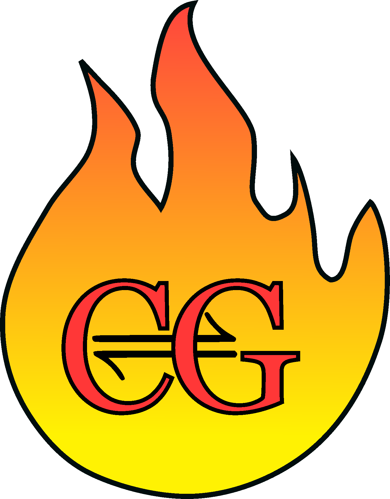
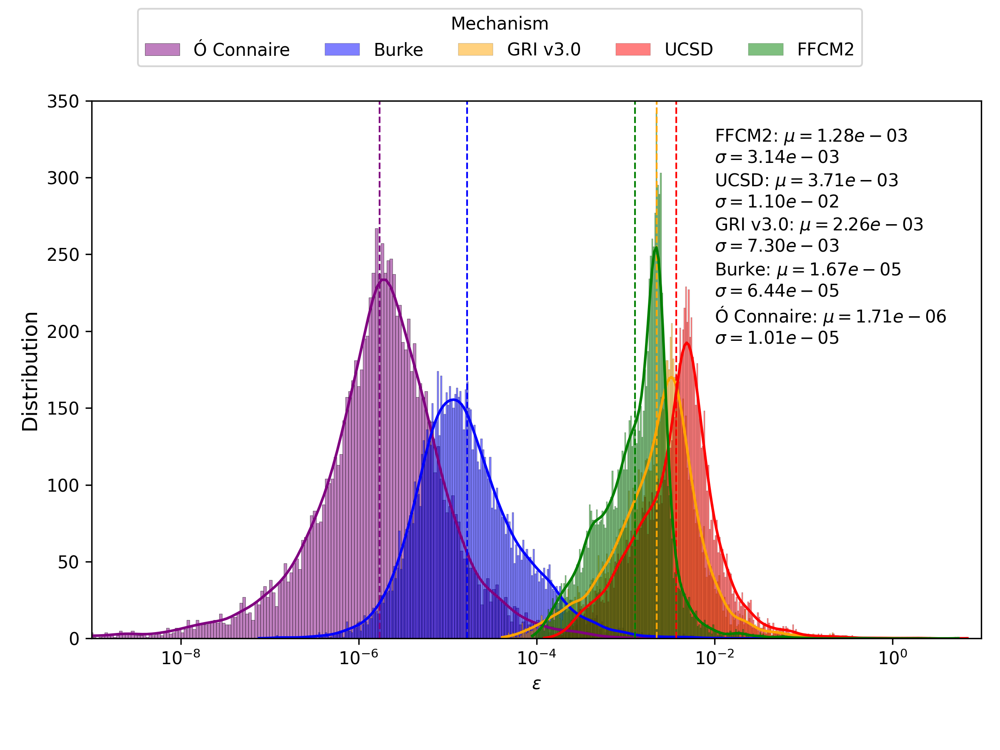
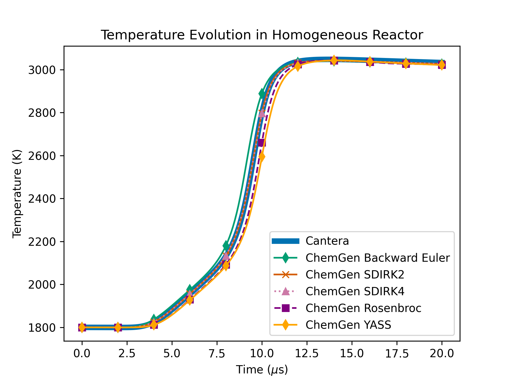
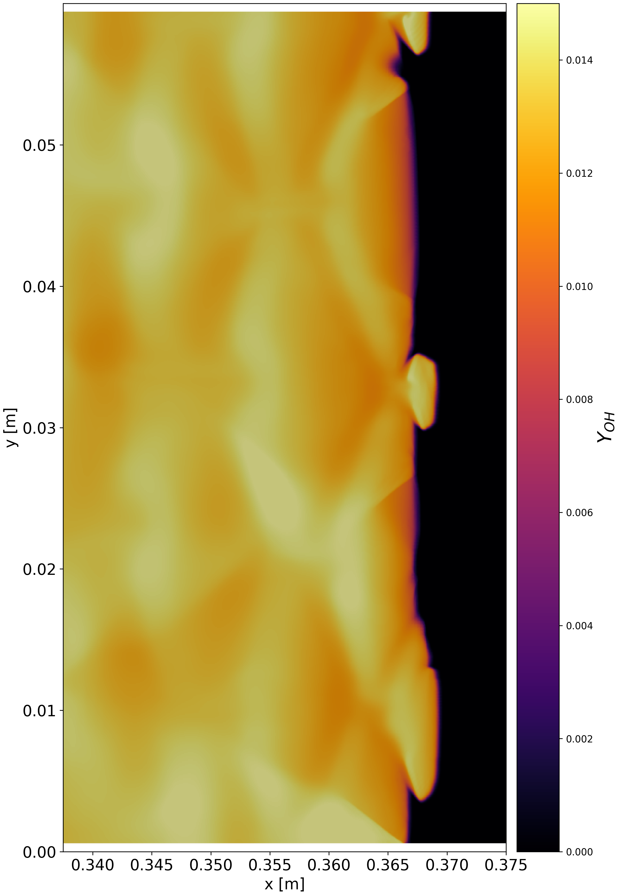
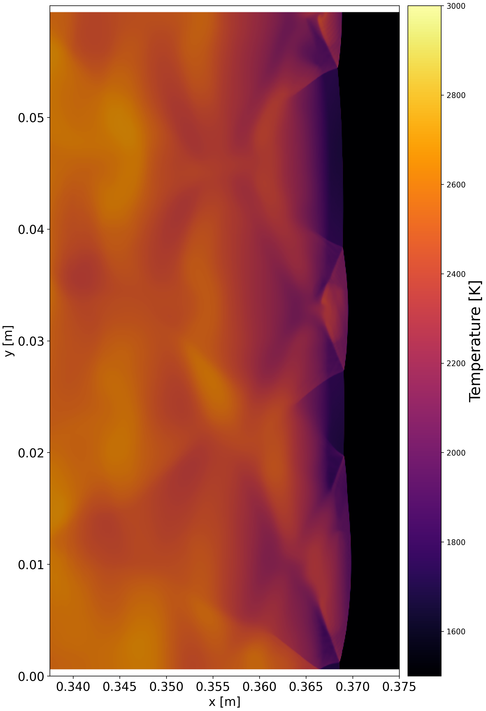

<h3 align="center">ChemGen</h3>
<p align="center">
  
</p>

---

## Table of Contents
- [Table of Contents](#table-of-contents)
- [Overview](#overview)
- [Installation](#installation)
- [Usage](#usage)
- [License](#license)

---

## Overview

ChemGen is a software package that uses code generation to integrate multispecies
thermodynamics and chemical kinetics into C++-based computational physics codes.
ChemGen aims to make chemical kinetics more accessible within existing simulation
frameworks and help bridge the gap between combustion modeling and computational physics.

ChemGen generates code to evaluate thermodynamic properties, highly accurate chemical
source terms (see Figure 1 left), and their analytical derivatives for Jacobian calculations.
It also provides a variety of implicit time-integration schemes, linear solvers,
and preconditioners (see Figure 1 right).


<p align="center">
  
  
</p>

<p align="center">
  <em>Figure 1: Source-term error histogram comparing ChemGen to Cantera (left), and example of implicit time-integration using various ChemGen implicit solvers (right).</em>
</p>

The various components of ChemGen are verified by demonstrating agreement with
Cantera and/or theoretical convergence rates, as reported in our arXiv manuscript
currently submitted to <em>Computer Physics Communications</em> [found here](https://arxiv.org/abs/2510.10005).

As an example of ChemGen’s capabilities, we have successfully integrated ChemGen
into OpenFOAM (see Figure 2) and achieved a speedup of approximately four times
over its native chemistry solver.

<p align="center">
  
  
</p>

<p align="center">
  <em>Figure 2: OH and temperature fields from a CFD detonation example using ChemGen chemistry.</em>
</p>

ChemGen is an ongoing project released under the <strong>NRL Open License</strong>, a
source-available license provided by the <strong>U.S. Naval Research Laboratory</strong>.

---

## Installation

To set up the ChemGen project on your local machine, please follow these steps:

1. Clone this repository:

   ```bash
   git clone https://github.com/drryjoh/chemgen.git
   cd chemgen
   ```

2. Install the required dependencies using Python 3:

   We recommend creating a unique Python environment using `python3.11`, which is the latest
   version compatible with Cantera:

   ```bash
   mkdir ~/python_environments/
   cd ~/python_environments/
   python3.11 -m venv chemgen
   source ~/python_environments/chemgen/bin/activate
   ```

   Optionally, add this alias to your `.bashrc` or `.zshrc`:
   ```bash
   alias chemgen="source ~/python_environments/chemgen/bin/activate"
   ```

   You can then activate your environment with:
   ```bash
   chemgen
   ```

   Once your Python environment is active, install the requirements:
   ```bash
   python3 -m pip install -r requirements.txt
   ```

   If a `requirements.txt` file is not present, you can manually install dependencies:
   ```bash
   python3 -m pip install cantera pyyaml matplotlib
   ```

---

## Usage

The best way to learn how to use ChemGen is through the tutorials located [here](tutorial/README.md).

---

## License

Released under **CC0 1.0 Universal**.  
No rights reserved. You may use, modify, and distribute this work without restriction.

Full text: https://creativecommons.org/publicdomain/zero/1.0/legalcode
