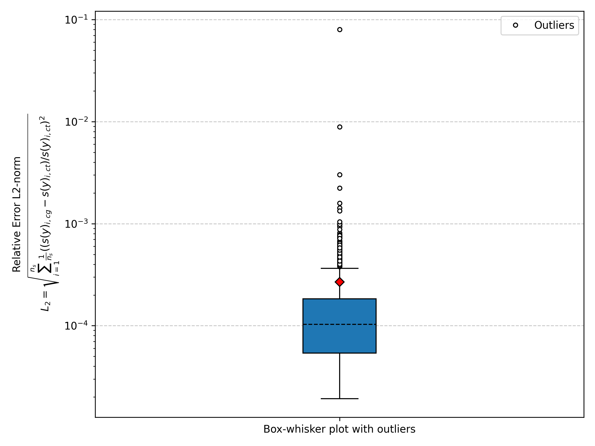
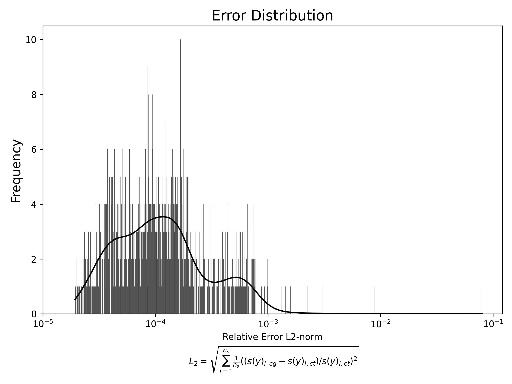

# Chemgen Error Assessment

## Table of Contents
- [Description](#description)
- [Preparation](#preparation)
- [ChemGen Execution Format](#chemgen-execution-format)
- [Generating Custom Tests](#generating-custom-tests)
- [Post-Processing Data](#post-processing-data)

## Description

This tutorial demonstrates how to use ChemGen to generate source code for evaluating species production source terms. The accuracy of these terms is then validated by comparing them to pre-calculated Cantera source terms.

---

## Preparation

For simplicity, we'll shorten references to ChemGen's paths. To access ChemGen in this directory, run the following command:

```bash
export PATH="$(cd ../../bin && pwd):$PATH"
```

Now, ChemGen can be executed from any directory by simply calling `chemgen.py`. Ensure that all [prerequisites are installed](../../README.md).

ChemGen provides a `--custom-test` option that allows you to override the default `write_test` function to create a custom `chemgen.cpp`. This tutorial includes a `custom_test.py` file for that purpose.


### ChemGen Execution Format

The typical format for executing ChemGen is:

```bash
chemgen.py [path/to/kinetics/file] [path/to/generated/code]
```

- **First Argument**: Path to the kinetics model file (e.g., `FFCM2_model`). Here FFCM2 is included in the repo, in `/chemical_mechanisms/` if it is not there ChemGen will look in the current directory. `.yaml` extension is assumed.
- **Second Argument**: Target directory for generated source code (e.g., `.`).

In this tutorial we use the command:

```bash
chemgen.py FFCM2_model . --custom-test custom_test.py --n-points-test 1000 --compile
```
where the addition, optional, chemgen commands are:

- `--custom-test`: Specifies a custom Python script to generate tests.
- `--n-points-test`: Sets the number of random points to test (e.g., `1000`).
- `--compile`: Compiles the generated test cases using the default compiler settings.

This tutorial uses the fondational fuel chemistry model 2 (FFCM2) kinetics and generates the source code in the current directory the folder src:

```
src/
├── array_handling.h
├── arrhenius.h
├── chemgen.cpp
├── constants.h
├── exp_gen.h
├── falloff_lindemann.h
├── falloff_sri.h
├── falloff_troe.h
├── generated_constants.h
├── multiply_divide.h
├── pow_gen.h
├── pressure_dependent_arrhenius.h
├── reactions.h
├── source.h
├── thermally_perfect.h
├── thermotransport_fits.h
├── third_body.h
└── types_inl.h
```

These files are generated from the `.in` files found in [chemgen/src](../../src/) and formatted given decorator specifications, more details found [here](../decorators/README.md). The file `source.h` contains the inline chemical source term calculations and `chemgen.cpp` is the custom test generated to test the generated chemical mechanism. All other files are necessary header files used to calculate the chemical source term.  This tutorial creates 1000 random chemical states using the [custom_test.py](custom_test.py) script and evaluates them against Cantera's prediction. `chemgen.cpp` is automatically compiled using the `--compile` command using the follow default compilation command: 
```bash
clang++ -std=c++17 -O2 -o ./bin/chemgen src/chemgen.cpp
```

Alternatively, one could use CMake for compilation:
```bash
chemgen.py FFCM2_model . --custom-test custom_test.py --n-points-test 1000 --cmake
```

---

## Details on the custom test script

This tutorial includes a `custom_test.py` file that overrides the default test generation functionality. This generates the `chemgen.cpp` file that contains several support functions, such as `l2_norm`, as well as the `main()` function that calls the generates source code and provides the test for the random chemical states.

### Test Overview

The custom test generates a specified number (`n_points`) of chemical states with randomly assigned chemical concentrations and temperatures. For each state:

1. The source term is calculated for each species.
2. The result is compared to the Cantera solution.
3. An L2-norm is computed for the error:

```math
l_2 = \sqrt{\sum_{i=1}^{n_s}\frac{1}{n_s}\left(\frac{S(y_i)_{cg} - S(y_i)_{ct}}{S(y_i)_{ct}}\right)^2}
```

Where:
- $`S(y_i)_{ct}`$: Source term from Cantera.
- $`S(y_i)_{cg}`$: Source term from ChemGen.

---

## Post-Processing Data

When the generated binary, `chemgen`, is run `./bin/chemgen` a `l2_norm_results.csv` which can then be post processed using `process_errors.py` with requirements `python3 -m pip install matplotlib seaborn`. 

```
./process_errors.py
```

The error distribution for one particular random set of entries is shown below as a box and whisker plot and distribution. The bow and whisker plot shoys only a few outliers ever making it above a 10% difference in reaction rate, with the mean around a relative error of less than 0.01 pct.


