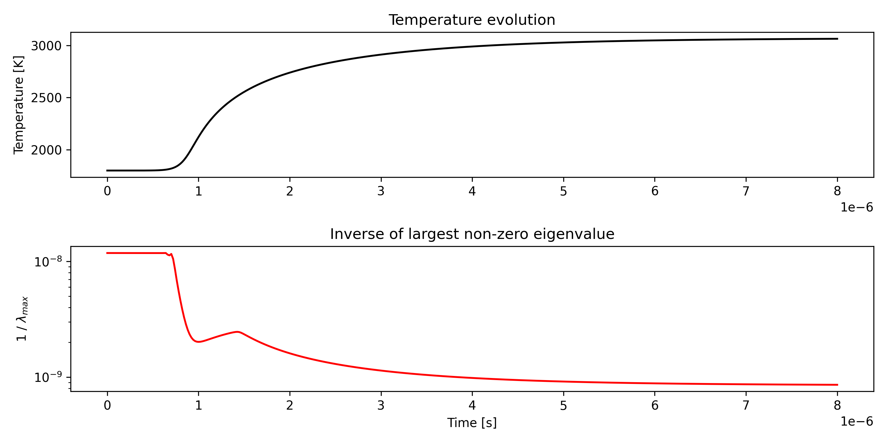

# ChemGen Tutorial

## Table of Contents
- [ChemGen Tutorial](#chemgen-tutorial)
  - [Table of Contents](#table-of-contents)
  - [Description](#description)
  - [Preparation](#preparation)
  - [Using pybind](#using-pybind)

## Description

This tutorial demonstrates how to use pybind to utilize ChemGen generated functions and interface with python. This creates simple features, like 
```python
source = cg.source(species, temperature)
source_jacobian = cg.source(species, temperature)
```

---

## Preparation

For simplicity, we'll shorten references to ChemGen's paths. To access ChemGen in this directory, run the following command:

```bash
export PATH="$(cd ../../bin && pwd):$PATH"
```

Now, ChemGen can be executed from any directory by simply calling `chemgen.py`. Ensure that all [prerequisites are installed](../../README.md).

ChemGen provides a `--custom-test` option that allows you to override the default `write_test` function to create a custom `chemgen.cpp`. This tutorial includes a `custom_test.py` file for that purpose.

In addition pybind requires extra dependencies which can be installed via
```
pip3 install pybind11 setuptools
```

## Using pybind

To execute this tutorial, use the following command:
```bash
chemgen.py ffcm2_h2.yaml . --pybind
```

This generates a `chemgen_pybind.cpp` file in `src` that includes all generated code and a C++ interface that pybind utilizes. Currently the supported functions are:
```cpp
PYBIND11_MODULE(chemgen, m)
{ 
    m.def("ignore_temp_dependence", &ignore_temp_dependence_py, "ignore_temp_dependence function");
    m.def("temperature_equation", &temperature_equation_py, "temperature_equation function");
    m.def("source", &source_py, "source function");
    m.def("source_jacobian", &source_jacobian_py, "source_jacobian function");
    m.def("sdirk4", &sdirk4_py, "SDIRK 4");
    m.def("rosenbroc", &rosenbroc_py, "Rosenbroc 2");
    m.def("yass", &yass_py, "YASS");
#if defined(CHEMGEN_INTERNAL_ENERGY_EQUATION)
    m.def("temperature_from_internal_energy", &temperature_from_internal_energy_py, "temperature 4");
#endif
    m.def("temperature", &temperature_py, "temperature");
    m.def("internal_energy_volume_specific", &internal_energy_volume_specific_py, "internal_energy_volume_specific");
    m.def("dtemperature_dspecies", &dtemperature_dspecies_py, "dtemperature_dspecies");
}
```

Here we will make use of `source` and `source_jacobian` and call them from python. Later tutorials will show how to add extra functionality. Please see this [issue](https://github.com/drryjoh/chemgen/issues/37)


A [configuration](configuration.yaml) is provided in this tutorial with an extra field

```yaml
solver:
  chemistry_solver: all
  linear_solver: gmres 
  preconditioner: jacobi
```

This handles the implicit solver functions `yass`, `sdirk4`, `rosenbroc`. Which can become optional, see [issue](https://github.com/drryjoh/chemgen/issues/37). 

To compile pybind use the following command:

```bash
python3 ./src/setup_chemgen.py build_ext --inplace
```

which compiles the ChemGen-python interface. The ChemGen module can then be utilized via

```bash
python3 chemgen_interface.py
```

Which generates the following image



The python script utilizes ChemGen via the module

```python
import chemgen as cg
```

Which, very much like the cantera counterpart, can be utilize to interface with the multispecies physics. In this scenario we calculate the source term Jacobian using
```python
J = np.array(cg.source_jacobian(C, T))
```

The eigenvalues of the source term Jacobian are then calculated to reveal the smallest time scales, $1/\lambda_{eigen}$ , of a homogeneous reactor as seen in the figure above.

