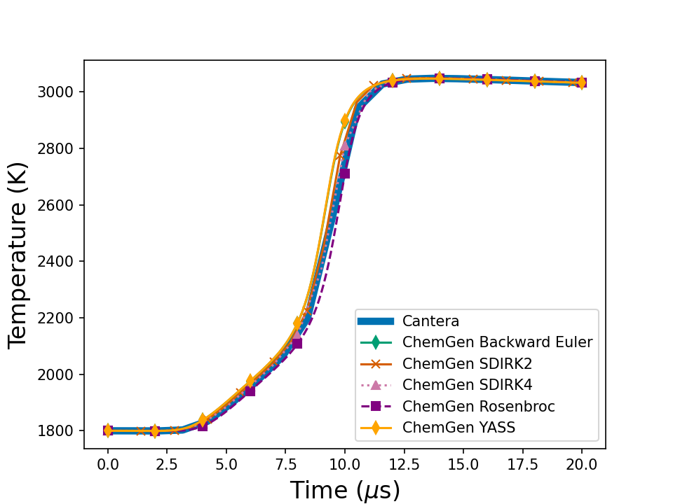
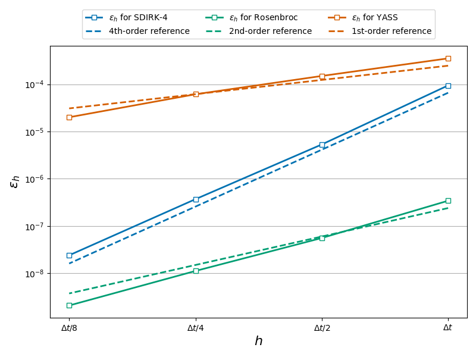

# ChemGen Tutorial

## Table of Contents
- [ChemGen Tutorial](#chemgen-tutorial)
  - [Table of Contents](#table-of-contents)
  - [Description](#description)
  - [Preparation](#preparation)
  - [Example 1: Homogeneous Reactor](#example-1-homogeneous-reactor)
  - [Example 2: Order of convergence](#example-2-order-of-convergence)
  - [Example 3: Timings](#example-3-timings)

## Description

This tutorial demonstrates how to use the various chemistry implicit solvers produced by **ChemGen**.

An implicit solver solves the system:

```math
(y^{n+1} - y^{n}) / \Delta t = S(y^{n+1})
```

Newton's method can be used to find $y^{n+1}$ via iteration by solving:

```math
G(y_k^{n+1}) * (y_{k+1}^{n+1} - y_k^{n+1}) = -f(y_k^{n+1})
```

where

```math
f(y_k^{n+1}) = (y^{n+1} - y^{n}) / Δt - S(y^{n+1})
```

for $y_{k+1}^{n+1}$, the state at the $(k+1)$th Newton iteration.  $G(y_k^{n+1})$ is the Jacobian for the time integration.

The Jacobian inversion is used in coordination with the various integration schemes provided by ChemGen, listed below.

| Strategy        | Order | Stages | # Linear Solves                  |
|-----------------|:------:|:-------:|----------------------------------|
| SDIRK-2         | 2nd   | 2       | up to $n_{\mathrm{max}}$ per stage |
| SDIRK-4         | 4th   | 5       | up to $n_{\mathrm{max}}$ per stage |
| Rosenbrock      | 2nd   | 2       | one per stage                      | 
| YASS            | 1st   | 1       | one                                | 
| Backward Euler  | 1st   | 1       | up to $n_{\mathrm{max}}$           | 

More details available in our paper under review and available [here](https://arxiv.org/abs/2510.10005).

---

## Preparation

For simplicity, we'll shorten references to ChemGen's paths. To access ChemGen in this directory, run the following command:

```bash
export PATH="$(cd ../../bin && pwd):$PATH"
```

Now, ChemGen can be executed from any directory by simply calling `chemgen.py`. Ensure that all [prerequisites are installed](../../README.md).

ChemGen provides a `--custom-test` option that allows you to override the default `write_test` function to create a custom `chemgen.cpp`. This tutorial includes a `custom_test.py` file for that purpose.

Beyond example 1, pybind is utilized to demonstrate certain properties which we recommend using the [pybind tutorial](/tutorial/05_pybind/README.md).

## Example 1: Homogeneous Reactor

To execute this tutorial, use the following command:
```bash
chemgen.py FFCM2_model.yaml . --custom-test custom_test.py --compile --run
```

A [configuration](configuration.yaml) is provided in this tutorial with an extra field

```yaml
solver:
  chemistry_solver: all
  linear_solver: gmres 
  preconditioner: jacobi
```

This generates all the chemistry solvers utilized in this tutorial. The custom test generated has blocks of code for each implicit solver approach:

```cpp
    for(int i = 0; i < n_run; i++)
    {
        y = backwards_euler(y, dt);
        t = t + dt;
        be_file << t << " " << temperature(y);
        for (const auto& val : get_species(y)) be_file << " " << val;
        be_file << "\n";
    }
```

The above example is for backwards_euler and the others follow the same pattern. The resulting homogeneous reactors using the various integration techniques are plotted using

```bash
python3 /post_ct.py 
```
which generates the figure below




## Example 2: Order of convergence 

To test the order of convergence we utilize pybind to call the implicit solvers:
```bash
chemgen.py ffcm2_h2.yaml . --pybind
python3 ./src/setup_chemgen.py build_ext --inplace
```

This will create the python interface to call ChemGen time integrators with relevant code

```python3
    for k in range(n_steps):
        y = cg.yass(C, T, dt, 0.1, dt_min, 10)
        C = y[1:]
        T = cg.temperature_from_internal_energy(C, y[0])
```
Running two python scripts will assess the convergence of these methods and plot them

```
python3 convergence_H2.py
post_convergence_H2.py
```



The above graph should be reproducible and confirm the implicit time integration order of accuracy.

## Example 3: Timings

In example 1, the GMRES linear solver was used to invert the linear system as well as Jacobi-preconditioner. This resulted in the following timings to approximate the same homogeneous reactor simulation
```bash
[Backward Euler] Time elapsed: 0.19073 seconds
[SDIRK2] Time elapsed: 0.0835206 seconds
[ROSENBROC] Time elapsed: 0.115918 seconds
[YASS] Time elapsed: 0.0842448 seconds
[RK4] Time elapsed: 0.355834 seconds
[SDIRK4] Time elapsed: 0.0616663 seconds
```

When changing these configuration from
```yaml
solver:
  chemistry_solver: all
  linear_solver: gmres 
  preconditioner: jacobi
```

to
```yaml
solver:
  chemistry_solver: all
  linear_solver: direct 
  preconditioner: none
```

The timings change by a factor of 2-3
```bash
[Backward Euler] Time elapsed: 0.491025 seconds
[SDIRK2] Time elapsed: 0.194187 seconds
[ROSENBROC] Time elapsed: 0.3543 seconds
[YASS] Time elapsed: 0.22021 seconds
[RK4] Time elapsed: 0.298288 seconds
[SDIRK4] Time elapsed: 0.171208 seconds
```

These implicit solvers are contained as standalone generated functions as well as the preconditioners.  
It is also perfectly reasonable to interface with well-utilized external solvers such as  
[**CVODEs**](https://computing.llnl.gov/projects/sundials/cvode) from the SUNDIALS suite or  
[**Eigen**](https://eigen.tuxfamily.org/) for linear algebra operations.
