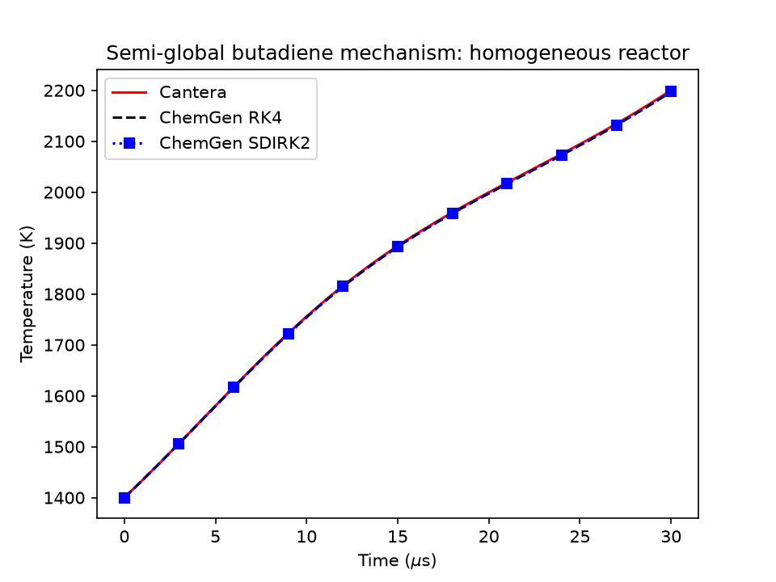

# ChemGen Tutorial

## Table of Contents
- [ChemGen Tutorial](#chemgen-tutorial)
  - [Table of Contents](#table-of-contents)
  - [Description](#description)
  - [Preparation](#preparation)
  - [Semi-global reaction orders](#semi-global-reaction-orders)
  - [Homogeneous Reactor Simulation](#homogeneous-reactor-simulation)
  - [Comparing RK4 and SDIRK2](#comparing-rk4-and-sdirk2)

## Description

This tutorial demonstrates ChemGen's support for **semi-global (global/reduced) reactions** -- reaction steps whose rate law is fit empirically instead of following mass-action kinetics from the reaction's stoichiometry. A classic example is the two-step Westbrook-Dryer-style oxidation of a hydrocarbon fuel:

```math
\text{Fuel} + a\, \text{O}_2 \rightarrow b\, \text{CO} + c\, \text{H}_2\text{O}
```
```math
\text{CO} + \tfrac{1}{2}\text{O}_2 \rightleftharpoons \text{CO}_2
```

where the forward rate of each step is not $[\text{Fuel}]^1[\text{O}_2]^a$ as plain mass-action kinetics would dictate, but an empirically-fit power law such as $[\text{Fuel}]^{0.25}[\text{O}_2]^{1.5}$ -- and can even depend on a species that is neither a reactant nor a product of that step (here, CO oxidation's rate is modified by $[\text{H}_2\text{O}]^{0.5}$, a well-known empirical correction). Cantera exposes this via a reaction's `orders` field; ChemGen now generates correct source terms *and* Jacobians for it, so these reactions integrate through the same RK4/SDIRK/Rosenbrock/YASS solvers as any other mechanism.

We use a small 3-reaction, 5-species butadiene (C4H6) mechanism, [semiglobal_butadiene.yaml](semiglobal_butadiene.yaml), to keep the example fast to compile and easy to inspect end-to-end:

```yaml
reactions:
- equation: C4H6 + 3.5 O2 => 4 CO + 3 H2O
  rate-constant: {A: 2.0925e10, b: 0.0, Ea: 30000}
  orders: {C4H6: 0.25, O2: 1.5}
- equation: CO + 0.5 O2 => CO2
  rate-constant: {A: 2.24e+12, b: 0.0, Ea: 12000}
  orders: {CO: 1.0, H2O: 0.5, O2: 0.5}
  nonreactant-orders: true   # H2O modifies this rate without being a reactant/product
- equation: CO2 => CO + 0.5 O2
  rate-constant: {A: 5.0e+8, b: 0.0, Ea: 77200}
  orders: {CO2: 1.0}
```

Note the `nonreactant-orders: true` flag on the second reaction -- Cantera requires this whenever `orders` names a species (H2O here) that isn't a reactant or product of that reaction, as a guard against typos.

---

## Preparation

For simplicity, we'll shorten references to ChemGen's paths. To access ChemGen in this directory, run the following command:

```bash
export PATH="$(cd ../../bin && pwd):$PATH"
```

Now, ChemGen can be executed from any directory by simply calling `chemgen.py`. Ensure that all [prerequisites are installed](../../README.md).

## Semi-global reaction orders

Generate the code and run ChemGen's default test to see the source term ChemGen computes agree with Cantera's, species by species, even though every species here is touched by at least one non-mass-action rate law:

```bash
chemgen.py semiglobal_butadiene.yaml . --compile --run-tests
```

```
*** ChemGen ***
...
Source test result:  [ -25.829 -0.120385 -50.3338 50.8154 0.361156 ]
Cantera test result: -25.8290247524314 -0.12038531611683077 -50.33381102757767 50.81535229204499 0.3611559483504923
```

The species order is `O2, C4H6, CO, CO2, H2O` (as declared in the mechanism). CO2's production and H2O's production both come entirely from reactions where they're not part of the rate-law's `orders` (CO2 is a *product* of the first reaction and the *reactant* of the third; H2O only ever *modifies* the second reaction's rate) -- this is the case that needs the true reactant/product stoichiometry and the rate-law's `orders` to be tracked separately, which is what this tutorial's underlying fix does.

## Homogeneous Reactor Simulation

This tutorial's [custom_test.py](custom_test.py) sets up the same homogeneous-reactor problem as [tutorial 04](../04_rk4/), but integrates it with **two** solvers from the same generated binary -- [configuration.yaml](configuration.yaml) requests both via:

```yaml
solver:
  chemistry_solver: all
  linear_solver: direct
  preconditioner: none
```

```bash
chemgen.py semiglobal_butadiene.yaml . --custom-test custom_test.py --compile --run-tests > chem_out.txt
```

- **RK4** (explicit): needs a small step (`dt = 1e-8 s`, 3000 steps) to stay stable through this state's fast initial timescales.
- **SDIRK2** (implicit, second-order): takes a **100x larger step** (`dt = 1e-6 s`, 30 steps) to reach the same final time (`t = 3e-5 s`), using `source_jacobian(...)` (the Newton solve inside SDIRK2) on this same semi-global mechanism.

Each solver's trajectory is tagged (`RK4 ...` / `SDIRK2 ...`) so both can be pulled out of one `chem_out.txt`.

## Comparing RK4 and SDIRK2

[post_ct.py](post_ct.py) independently integrates the identical initial condition with Cantera's `IdealGasReactor` and overlays all three:

```bash
./post_ct.py
```



RK4 and SDIRK2 agree with each other to within their final temperature's fourth significant figure (2197.29 K vs. 2197.36 K) despite the 100x difference in step size, and both agree with Cantera's independent integration (2200.19 K) to within ~0.1% -- confirming both the semi-global source term/Jacobian and the two solvers are working correctly together on this mechanism.
